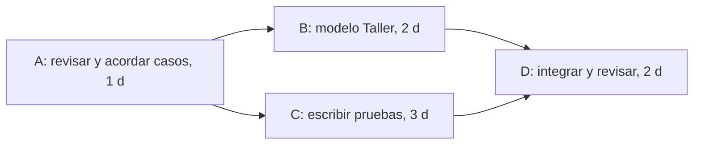

# Sesiones 8 y 9 — Plan del siguiente incremento

- Proyecto: P03 — Inscripciones a talleres y listas de espera
- Integrantes: Gonzalo Cárdenas, Santiago Arauz, Andrea Trujillo
- Fecha del plan: 6 de octubre de 2026

## 1. Fuentes, flujo elegido e IDs

- Sesión 6: [sesion-06-requisitos.md](sesion-06-requisitos.md)
- Sesión 7: [sesion-07-modelos.md](sesion-07-modelos.md)
- Flujo elegido: **TAL-CU-01 — Solicitar inscripción a un taller** (confirmar plaza, lista de espera o rechazo).
- IDs relacionados: `TAL-HU-01`, `TAL-MOD-01`, `TAL-RF-01`, `TAL-RF-02`, `TAL-RF-05`. Encargo inicial: `TAL-03` y `TAL-04`.
- `TAL-RF-08` / `ENT-11` (historial de cancelaciones) sigue **provisional**.

### Punto de partida: qué ya existe

El flujo ya tiene una implementación parcial hecha por Andrea. Fecha en que se hizo: 02/10/2026

| Parte del flujo | Estado en el código | Verificado |
|---|---|---|
| Modelos `Inscripcion` (estados CONFIRMADO / EN_ESPERA / CANCELADO, posición de espera) y `HistorialCancelacion` | Escritos | No |
| `registrar_inscripcion`: taller no iniciado (E1), usuario no inscrito, choque de horario (E3), confirmar si hay cupo | Escrito | No |
| Lista de espera con límite del 20 % (E4) y rechazo si está llena (E5) | Escrito | No |
| `cancelar_inscripcion`, promoción del primero en espera, registro en el historial | Escritos | No |
| Modelo `Taller` y creación de talleres | **No existe** (solo se referencia con `'Taller'`) | — |
| Pruebas automáticas | **No existen** | — |
| Rechazo por exceso de cancelaciones recientes (E2) | **No implementado** (el historial se guarda, pero no se consulta) | — |

Nada se ha ejecutado todavía: el código está escrito, no comprobado.

### Brechas que elegimos para este incremento

1. No existe el modelo `Taller` ni forma de crear talleres, por lo que el flujo no puede ejecutarse.
2. No hay pruebas que demuestren los casos aceptado, E1, E3, E4 y E5.

## 2. Alcance del próximo incremento

**Incluye:**
- Solicitar inscripción con plaza disponible: queda **Confirmada** y las plazas ocupadas aumentan en 1 (`TAL-RF-01`).
- Solicitud con taller lleno: queda **En espera** en la última posición (`TAL-RF-02`).
- Rechazos con conservación de datos: taller ya iniciado (E1), choque de horario (E3, `TAL-RF-05`) y taller y lista de espera llenos (E5).
- Creación de talleres con los datos mínimos que usa el flujo (código, cupo máximo, inicio y fin).
- Caso límite reutilizado de la sesión 6: taller `FUT-PAR-01`, cupo 20, 20 ocupadas, espera con 4 de 4 (`TAL-RF-02`).

Fuera de este incremento: 
- E2, rechazo por más de 3 cancelaciones en 72 horas: la regla de baneo sigue pendiente (`ENT-11`).
- Envío real de notificaciones por WhatsApp (`ENT-01`), cambio de cupo (`TAL-RF-07`), volver a inscribirse tras cancelar (`TAL-RF-04`) y solicitudes simultáneas (`TAL-RC-01`).

**Dependencias:**
- El modelo `Taller` debe existir antes de poder ejecutar cualquier prueba (tarea B).
- Redondeo del 20 % pendiente con el cliente. El código actual usa `int()`, que trunca (cupo 12 → 2 en espera).

**Supuestos:**
- El participante ya está identificado (sin registro ni inicio de sesión).
- Existe alguien que quiere inscribirse 
- Ya tenemos talleres 
## 3. Tareas
## 3. Tareas

| Tarea | Trabajo y evidencia de terminación | Esfuerzo | Duración | Predecesoras | Responsable |
|---|---|---:|---:|---|---|
| A | Revisar el código existente contra `TAL-CU-01` y acordar los casos concretos de prueba. Evidencia: lista de casos con IDs, coherente con la sesión 6. | 3 h-p | 1 día | Ninguna | Andrea |
| B | Crear el modelo `Taller` (código, cupo máximo, inicio, fin) y talleres de demostración. Evidencia: talleres creados y usados por el flujo. | 2 h-p | 2 días | A | Gonzalo |
| C | Escribir las pruebas de los casos acordados, incluida la conservación de datos en cada rechazo. Evidencia: pruebas escritas con las expectativas de los requisitos. | 6 h-p | 3 días | A | Santiago |
| D | Integrar `Taller` y pruebas, ejecutarlas, corregir fallos del código existente y documentar cómo demostrar el flujo. Evidencia: versión comprobada e instrucciones. | 4 h-p | 2 días | B y C | Andrea y Santiago |

Esfuerzo total: **15 h-p**.

## 4. Red, tiempos y ruta crítica

Tiempos en días desde `t = 0`. La meta del recorrido hacia atrás es `6 días`.

| Tarea | Duración | IT | FT | ITa | FTa | Holgura |
|---|---:|---:|---:|---:|---:|---:|
| A | 1 | 0 | 1 | 0 | 1 | 0 |
| B | 2 | 1 | 3 | 2 | 4 | 1 |
| C | 3 | 1 | 4 | 1 | 4 | 0 |
| D | 2 | 4 | 6 | 4 | 6 | 0 |

- Ruta crítica: **A → C → D**, con `1 + 3 + 2 = 6 días`.
- Otra ruta: A → B → D, con `1 + 2 + 2 = 5 días`. B tiene 1 día de holgura bajo los supuestos iniciales.
- Duración inicial del incremento: **6 días**.

### Gantt inicial

| Tarea | Día 1 (02/10) | Día 2 (06/10) | Día 3 (09/10) | Día 4 (12/10) | Día 5 (13/10) | Día 6 (14/10) |
|---|---|---|---|---|---|---|
| A | ■ | | | | | |
| B | | ■ | ■ | | | |
| C | | ■ | ■ | ■ | | |
| D | | | | | ■ | ■ |

## 5. Disponibilidad
No hay conflicto
## 6. Riesgos

| Riesgo | Probabilidad y razón | Consecuencia en el incremento | Respuesta antes del problema | Señal y contingencia | Responsable |
|---|---|---|---|---|---|
| El redondeo del 20 % de la lista de espera no está definido y el código trunca con `int()` (cupo 12 → 2; cupo menor a 5 → sin lista de espera). | Alta: la pregunta sigue pendiente con el cliente y el caso ocurre con cualquier cupo no múltiplo de 5. | Las pruebas de E4 y E5 podrían tener resultados esperados incorrectos (tareas C y D). | Consultar al docente antes de cerrar los casos en A; probar solo con cupos donde el resultado es claro (20 → 4). | Si el cliente confirma otra regla de redondeo, se ajusta la función y las pruebas, y se revisa la duración de C y D. | Andrea |
| Quien escribe las pruebas aún no domina cómo probar con la base de datos de Django. | Media: no hay pruebas previas en el proyecto. | La tarea C tarda más y retrasa la ruta crítica (A → C → D). | Revisión temprana de la primera prueba escrita (el caso aceptado) con otro integrante. | Si al final del día 2 no hay una prueba ejecutando, se apoya y se actualiza la previsión. | Santiago |

## 7. Entregable, hito y estado real

**Entregable:** flujo de solicitud de inscripción con modelo `Taller`, pruebas e instrucciones reproducibles.

**Hito verificable:** revisión completada en la que, con un taller de demostración:
- una solicitud válida queda Confirmada y las plazas ocupadas aumentan en 1;
- con el taller lleno, la solicitud queda En espera en la última posición;
- un taller iniciado, un choque de horario y un taller y espera llenos son rechazados sin alterar cupo, lista de espera ni inscripciones previas;
- las pruebas y la demostración corresponden a la misma versión (mismo commit).

Este plan no prueba que el hito ya se alcanzó.

### Estado real al cerrar la actividad (06/10/2026)

| Tarea | Estado | Evidencia o explicación | Horas reales |
|---|---|---|---|
| A | No iniciada | El código existe, pero no fue revisado contra `TAL-CU-01`. | No registradas |
| B | No iniciada | El modelo `Taller` no existe. | No registradas |
| C | No iniciada | No hay pruebas escritas. | No registradas |
| D | No iniciada | Depende de B y C. | No registradas |

Lo que ya funciona **según el código escrito, sin comprobar**: modelos de inscripción e historial, reglas de E1, E3, E4 y E5, cancelación y promoción. Lo que falta: `Taller`, pruebas, E2 y la verificación de todo lo anterior.

## 8. Siguiente acción 

- **Siguiente acción:** Andrea revisa el código y realiza sus consultas al cliente
